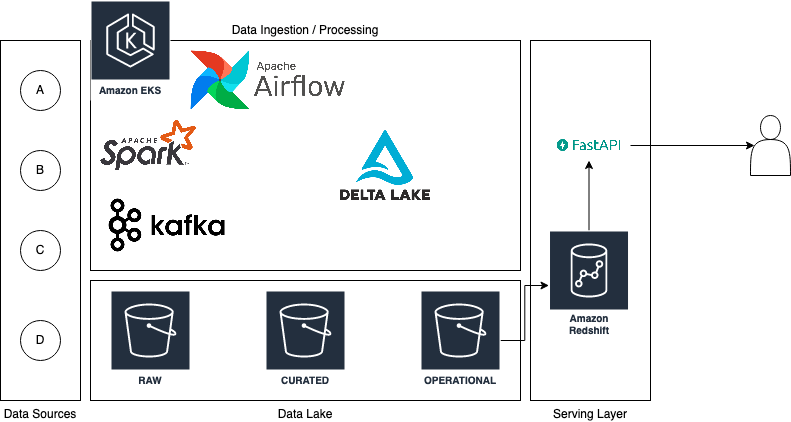

# 03 - Architecture Design

## Architecture Overview

The proposed architecture is divided into three main sections:
* **Data Lake:** Where all the raw or (semi)processed data is stored
* **Data Ingestion/Processing:** The infrastructure that will ingest or process data coming from the data sources
* **Serving Layer:** The endpoints exposed to users to either upload or download data

### Data Lake

The data lake is where all the data gets stored. It is divided into three logical areas:

* **Raw area:** This area contains all the data stored exacly how it comes from the sources.
* **Curated area:** In this area the raw data is converted and compated using a columnar format - such as Parquet - and some basic operations are performed on the raw files (e.g. unnesting JSON objects)
* **Operational area:** The operational area is where business logic starts being applied to the data, so curated datasets are transformed and/or combined to create the building blocks of the data model offered to business and customers.
The operational area could contain also an *aggregated* area that contains datasets answering to very specific business questions.
Aggregated dataset could be then copied to the serving layer to be accessed more quickly by clients.

### Data Ingestion/Processing

For this layer the suggested solution relies on a Kubernetes cluster that runs several services:
* Airflow to schedule ETL jobs
* Spark to either ingest or process data
* Kafka + Spark Streaming to ingest data coming from streaming APIs

Additionally, Delta Lake can be used to grant Spark ACID capabilities on Curated and Operational datasets, if needed.

#### Sources A and B
##### Ingestion
It is unknown what data is coming from these sources, but they are delivered through FTP or HTTP to download.

There are two possible options:
* **Source -> S3:** it is possible to enable a FTP server to directly upload data to a S3 bucket, if the source is allowed to upload on 3rd party buckets. The `PutObject` event might then trigger ETL jobs waiting for this file
* **ETL -> Source:** an ETL job is scheduled to download the file via FTP or HTTP and store it on S3 in the Raw area

Source A is ingested every day, and source B is ingested every 14 days. Both could be inserted in the raw area inside a partitioned folder, using the ingestion date as a partition. For example: `s3://my-bucket/raw/source_X/day=2021-10-04`.

##### Processing
In the curated area, these data sources could be compacted and partitioned in a more meaningful way:
* Data coming from source A has a 3 days lag, so all the data in a file ingested in a certain date could be moved to a partition 3 days before (e.g. raw data in the `2021-10-04` partition will be moved to the curated `2021-10-01` partition).
* Data coming from source B is ingested every 14 days, but it is unknown if it contains any meaningful timestamp field. If it does, the date contained in this timestamp could be used as a meaningful date partition, otherwise the ingestion date will remain the best possible value for the date partition in the curated data.

There is no available information about what kind of data these sources contain, so the data could end in the operational area exactly as it is in the curated area.

#### Source C
##### Ingestion
Data source C is used to get either 7-day weather forecasts or the weather at a current timestamp for a specific region, identified by longitude and latitude.
An ETL job scheduled daily - or hourly - could poll these endpoints getting both forecasts and current weather for each region, it will insert in two separate folders forecasts and current weather, partitioned only by date (each day there will be 24 records per region, therefore partitioning by region too is useless).
##### Processing
Some aggregated datasets could contain rolling weather averages, calculated either by using the historical current weather data or the forecast data for future dates.

#### Source D
##### Ingestion
Source D contains near real-time data, therefore Kafka is the right tool for the job: a data producer will continuously poll the rest endpoint to get the latest data and store it inside a dedicated topic. Then a Spark Streaming consumer can take this data and store it in the raw area. In this case it might be worthwile adding the hour as a partition column instead of using only the date, to guarantee better performance to the Spark jobs compacting/processing this data. An hypotetical path could be `s3://my-bucket/raw/source_D/day=2021-10-04/hour=19`.
##### Processing
This data is very granular, so the operational area could contain daily aggregations of market interest or other KPIs related to a specific region.
If the list of regions is unknown at the beginning, then a regions table could be generated starting from this data, including all the regions ever appearing in these events. This could also be useful to understand for which regions it could be worth to ingest weather data from Source C.

### Serving Layer

This layer is composed by a Redshift cluster and an ECS/EKS cluster running all the REST endpoints that should return data to customers, for example using FastAPI. 
The purpose of Redshift is to return data upon queries from the REST clients. Redshift was chosen because thanks to Spectrum it can query both data stored internally and data stored on S3 from the Operational area.

## Use cases

### Case 1
**Using a REST API, I want to get the average weather, average market interest and accompanying data for a region**

It would be possible to join weather and market aggregated data on region and filter on the latest available date, in order to get the latest calculated averages.
An additional join could be done with the table containing all the region metadata in order to get region metadata (since this data changes less frequently, it could also be cached on something like redis, to save one join).

### Case 2
**I want to get all daily weather data and daily market prices of the past 15 years and store the data in appropriate data structures**

* **Daily weather data:** for all known regions the Source C 'current weather' endpoint could be contacted providing also a timestamp that starts at midnight of 15 years before the current date. Iterating hour by hour to the current date it is possible to have all this data. Since it is a bulk insertion, there is no need to store each single response in a single file, these requests could be done in bulk and parallelized by Spark (for example calculating in advance all the region/timestamp combinations and save the endpoint responses in a DataFrame) and stored efficiently on S3.
* **Daily Market Prices:** market data comes from Source D which is a near real-time data source, therefore it is not possible to go back in time. It is possible to store daily aggregations starting from the date in which data starts being consumed.

### Case 3
**I want to get data for a single region of the past 15 years, run analyses on it and store the results for consumption by a REST API**

A customer with access to Redshift could create a table/view in a schema dedicated to analytics, and a REST endpoint could take the table name as input parameter and return the contents of such table (checking the user has access rights to it).

### Case 4
**As a customer, I want to upload proprietary data Z, and then run custom analyses on data Z and the data from data sources A and B and access it through the REST API**

Customers could publish custom datasets in their personal area on Redshift, either directly in its storage using a `COPY` command or having a `personal_area` folder dedicated onto `S3`, and then create an external Spectrum table pointing to that location.
This data could then be joined/compared with data from sources A and B, saving the output to a `VIEW` or a `TABLE`. Then just like in *Case 3* the customer could access this data via REST APIs.
